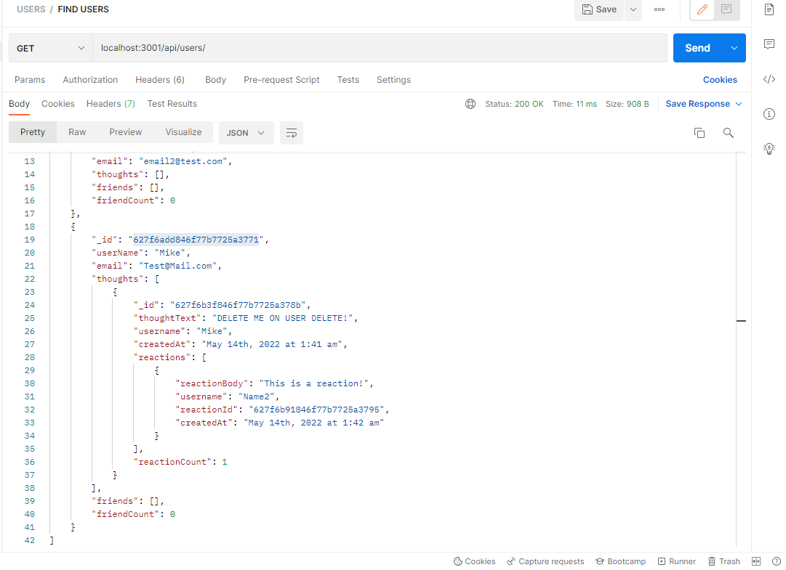

  # Social Media API- A NoSQL Javascript Backend Framework

  ## **Description**
   
  - Social Media API offers the framework for a social media application, using NoSQL. Users can create a username, and post thoughts. Other Users can react to thougths to interact! 
  - This application was written using JavaScript, Node, Express.js, MongoDb, and Mongoose.
  - The motivation behind Social Media API my desire to grow my skills using a NoSQL database.
  - While building this database and API framework I challenged myself follow the MVC paradigm, applied to a 
  NoSQL database, using Mongoose to interact with the database.

  ## **Table of Contents** 
  
  - [installation](#installation)
  - [Usage](#usage)
  - [Credits](#credits)
  - [License](#license)

  ## **Installation**

 To install the framework, please clone the code from my repository to your local machine. Run `npm i` to install dependencies and then run `npm start` to run the server and database. You can then test API routes in your preferred API test directory- i.e. Postman, Insomnia, etc. 

  ## **Usage**

  Simply open your API test directory, navigate to localhost:3001/api/[your route here]

  ## **Credits** 

  This project was built by Michael Cortez-Mejia 

  
  ## **License**

  

  To see more info regarding this license, please visit https://choosealicense.com/licenses/mit/
  

  ## **How to Contribute**

  If you would like to add/contribute to the project, feel free to fork from GitHub @MCORTEZM1 
  Or click here: https://github.com/MCORTEZM1/SocialMedia-API

  ## **Questions / Contact Me**

  Please reach out with any questions or concerns directly to: mcortezm@yahoo.com

## **Tests**

Test all of the CRUD routes for Users and Thoughts!  

